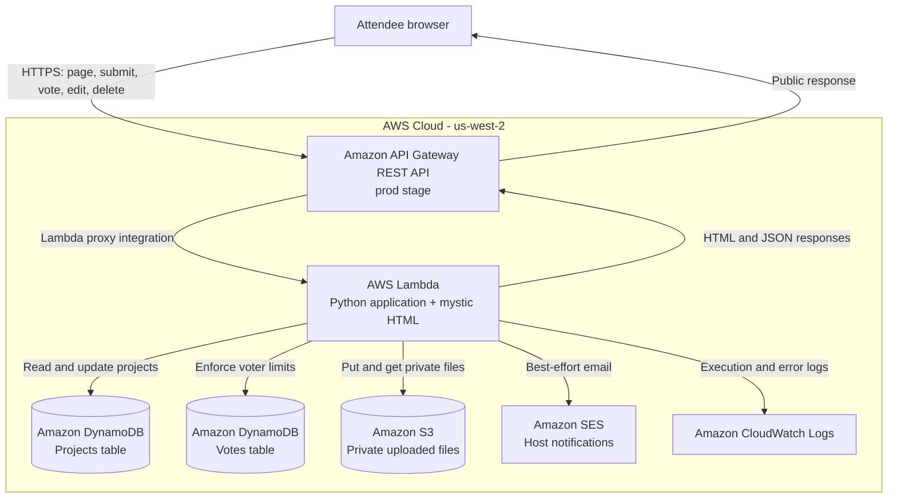

# Celestial Project Showcase & Voting

# Celestial Project Showcase & Voting

A serverless project gallery and live voting podium created for the **Women in AI/ML (Amazon)** and **Singapore Computer Society** community.

<p align="center">
  <a href="https://acasu1d5ci.execute-api.us-west-2.amazonaws.com/prod/"><strong>Visit the live showcase →</strong></a>
</p>

> **Live website:** https://acasu1d5ci.execute-api.us-west-2.amazonaws.com/prod/

The showcase lets workshop attendees introduce a production-grade app or agent, attach supporting resources, browse other projects, and vote for their favorites. Rankings update automatically and the five leading projects ascend a live, celestial podium.

## What visitors can do

### Submit a project

Each submission can include:

- Creator name and email
- Project title and short description
- A public project URL **or** an uploaded ZIP, image, PDF, or HTML file
- Optional project thumbnail URL
- Optional YouTube, Loom, or Vimeo demo
- Optional GitHub repository
- Optional live app or product webpage

Uploaded files are stored in a private Amazon S3 bucket and are never made publicly readable at the bucket level.

### Discover projects

The gallery supports:

- Tarot-inspired project cards
- Project image and video previews
- A detailed **Learn more** view
- Search by project or creator
- Sorting by votes, newest submission, or title
- Direct project, GitHub, live-app, demo, and attachment links
- Native sharing or copy-to-clipboard sharing

### Vote

- A voter supplies an email address.
- Each email can cast up to **three votes**.
- The same email can vote only once for a given project.
- Vote limits are enforced by the Lambda backend, not only by browser state.
- If a project is removed by its owner, votes for it stop consuming voters' allowances.

> This is a medium-integrity community voting model. Email ownership is not verified, so it prevents casual duplicate voting rather than determined identity abuse.

### Edit or remove a submission

After submission, the creator receives a private edit key:

- The raw key is shown once and saved in that browser's local storage.
- DynamoDB stores only a SHA-256 hash of the secret token.
- The key can be copied to another browser or device.
- It authorizes editing or removing only that project.
- Creator identity, original submission time, and vote count cannot be changed.
- Editing and removal close when submissions close.

Removal is implemented as a recoverable soft delete. The project disappears from public routes immediately, while its private DynamoDB record and S3 object remain available to the host for audit or recovery.

## How the podium works

1. The browser requests `GET /projects` when the page opens.
2. The Lambda scans the projects table and excludes soft-deleted records.
3. Projects are ordered by:
   1. `vote_count` descending
   2. `created_at` ascending for ties
4. The first five become the live podium:
   - Places 1–3 appear on the three-dimensional podium.
   - Places 4–5 appear as runner-up cards.
5. While voting is open, the page refreshes every **15 seconds**.
6. Polling pauses when the browser tab is hidden and stops after the deadline.
7. At the deadline, the podium changes from a live leaderboard to the final winners.

## AWS reference architecture



The Lambda itself does not use a public Function URL. Attendees access the regional API Gateway `prod` endpoint, and API Gateway invokes Lambda using proxy integration.

For component-level details, request sequences, data models, trust boundaries, failure behavior, and scaling considerations, see **[REFERENCE-ARCHITECTURE.md](REFERENCE-ARCHITECTURE.md)**.

## AWS services

| Service | Responsibility |
|---|---|
| Amazon API Gateway | Public HTTPS endpoint and proxy routing |
| AWS Lambda | Serves the UI and runs all application logic |
| Amazon DynamoDB | Stores projects, edit-token hashes, vote counts, and voter/project relationships |
| Amazon S3 | Stores uploaded project files in a private bucket |
| Amazon SES | Sends best-effort submission notifications to verified hosts |
| Amazon CloudWatch Logs | Captures Lambda execution and error logs |
| AWS IAM | Restricts Lambda access to the application's tables, bucket prefix, SES, and logs |

## Public routes

| Method | Route | Purpose |
|---|---|---|
| `GET` | `/` | Serve the showcase page |
| `GET` | `/projects` | Return active projects, vote counts, deadline, and open/closed state |
| `GET` | `/file?id=…` | Stream an uploaded file from private S3 storage |
| `POST` | `/submit` | Create a project and issue its private edit key |
| `POST` | `/vote` | Cast a server-validated vote |
| `POST` | `/update` | Edit a project using its private edit key |
| `POST` | `/delete` | Soft-delete a project using its private edit key |

API Gateway is configured with `ANY /` and `ANY /{proxy+}`, so all application paths are forwarded to the same Lambda handler.

## Repository layout

```text
showcase-app/
├── README.md
├── REFERENCE-ARCHITECTURE.md
├── DEPLOYMENT.md
├── LICENSE
├── .gitignore
├── lambda_function.py
├── showcase.html
└── dist/
    └── vibecoding-women-showcase.zip
```

- `showcase.html` is the celestial interface served by Lambda.
- `lambda_function.py` contains the page server and all API routes.
- `dist/vibecoding-women-showcase.zip` is the ready-to-upload Lambda package.
- `DEPLOYMENT.md` contains the deployment and smoke-test procedure.
- `REFERENCE-ARCHITECTURE.md` documents the AWS design in depth.
- `LICENSE` is the MIT license for reuse.

## Configuration

The Lambda reads these environment variables:

| Variable | Default/example | Purpose |
|---|---|---|
| `APP_REGION` | `us-west-2` | AWS service region |
| `PROJECTS_TABLE` | `vibecoding-women-showcase-projects` | Projects table |
| `VOTES_TABLE` | `vibecoding-women-showcase-votes` | Votes table |
| `UPLOAD_BUCKET` | `vibecoding-women-showcase-uploads` | Private file bucket |
| `SENDER_EMAIL` | SES-verified address | Notification sender |
| `HOST_EMAILS` | Comma-separated addresses | Submission notification recipients |
| `DEADLINE_UTC` | `2026-10-31T15:59:00Z` | 31 October 2026, 23:59 SGT |
| `SEND_SUBMITTER_CONFIRMATION` | `false` | Optional submitter email; off for SES sandbox |
| `MAX_VOTES_PER_EMAIL` | `3` | Total active-project votes per email |
| `MAX_FILE_BYTES` | `6291456` | Six-megabyte attachment limit |

## Security highlights

- S3 Block Public Access remains enabled.
- Files are accessed only through the Lambda execution role.
- No presigned upload URLs are used.
- The public project API does not expose submitter emails or edit-token data.
- Raw edit tokens are returned once; only SHA-256 hashes are persisted.
- Edit and delete writes use conditional DynamoDB expressions.
- Deadline checks are enforced by server time.
- Deleted files are blocked by the application even though the private object is retained.
- The Lambda execution role follows least privilege for the two tables, one S3 prefix, SES, and CloudWatch Logs.

## Deploy or update

If the AWS resources already exist, deploy the current version by uploading:

```text
dist/vibecoding-women-showcase.zip
```

to the existing `vibecoding-women-showcase` Lambda in `us-west-2`, then hard-refresh the live `prod` URL.

If API Gateway already uses `ANY /` and `ANY /{proxy+}`, no API Gateway redeployment is required for new application routes. See **[DEPLOYMENT.md](DEPLOYMENT.md)** for the full checklist.

## Current design constraints

- This implementation is intentionally optimized for a workshop-scale audience rather than a large public marketplace.
- `GET /projects` scans the projects table and is appropriate for the expected project count; a larger deployment should add pagination or indexes.
- The browser polls rather than using WebSockets.
- Uploaded files travel as base64 through API Gateway and Lambda, so the six-megabyte limit is important.
- Thumbnail images currently use publicly reachable image URLs.
- SES submitter confirmations remain off while the AWS account is in the SES sandbox.

## License

Released under the [MIT License](LICENSE).

## Branding

This showcase is presented by **Women in AI/ML (Amazon)** and **Singapore Computer Society**.
