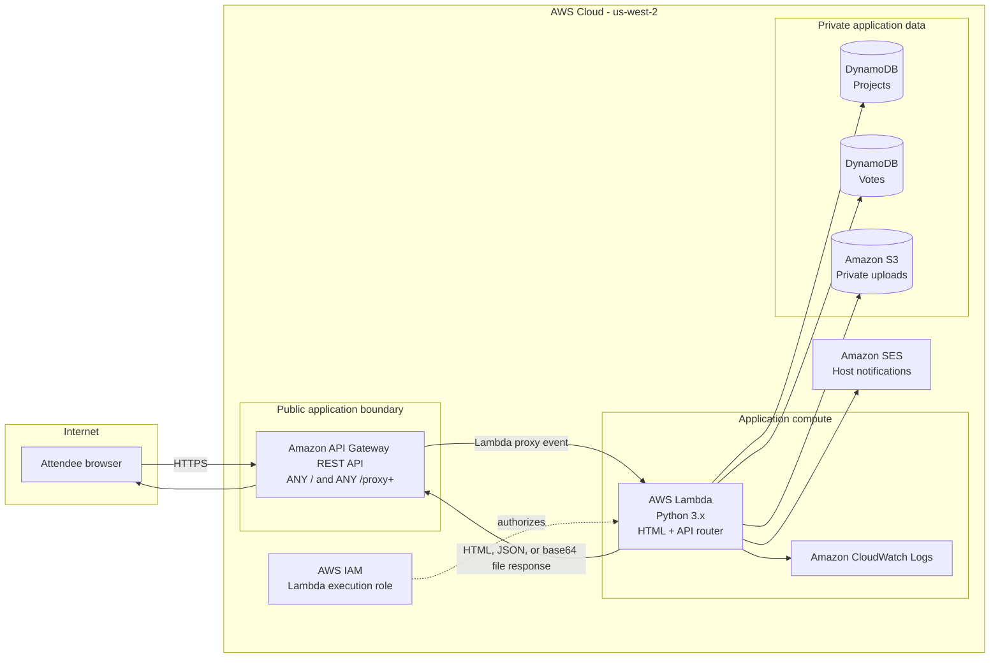
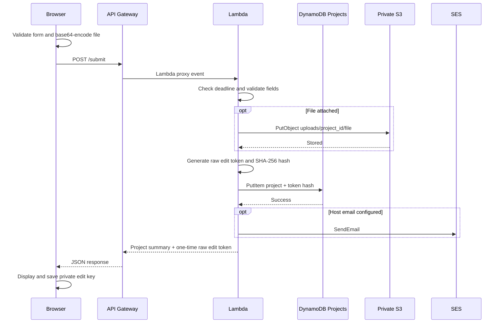
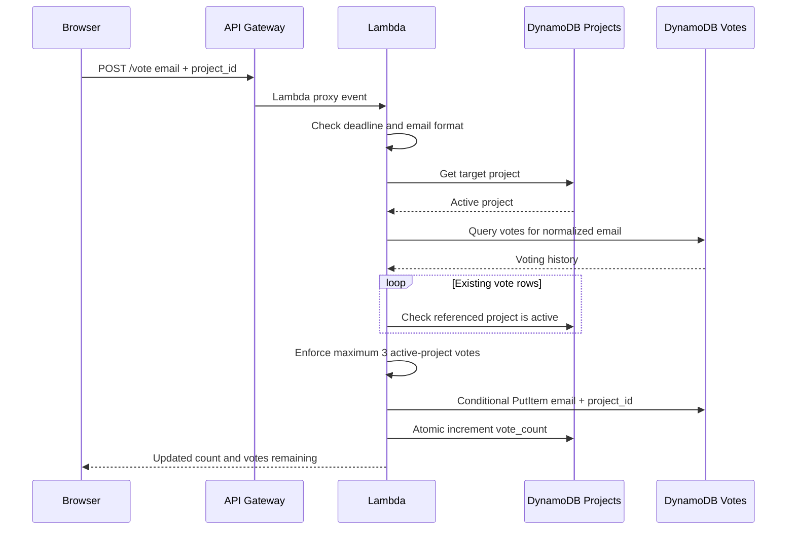
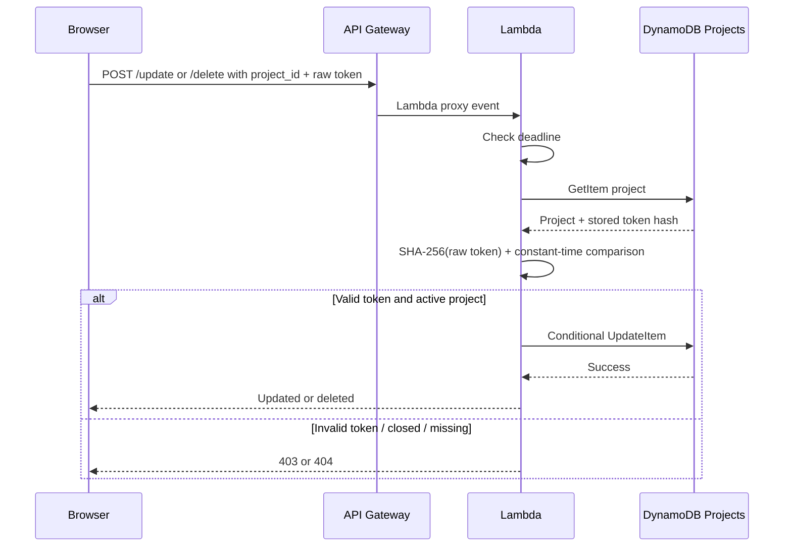
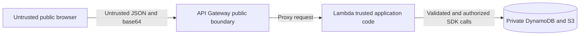

# AWS Reference Architecture

This document explains the AWS implementation behind the **Celestial Project Showcase & Voting** application presented by **Women in AI/ML (Amazon)** and **Singapore Computer Society**.

- **Live application:** https://acasu1d5ci.execute-api.us-west-2.amazonaws.com/prod/
- **AWS Region:** `us-west-2`
- **Application style:** serverless, single-Lambda web application
- **Primary interface:** API Gateway REST API `prod` stage

## 1. Architecture overview



### Why API Gateway is the public boundary

The AWS account blocks public unauthenticated Lambda Function URLs. API Gateway therefore acts as the internet-facing service, while Lambda remains invokable through its API Gateway integration.

Two proxy resources are sufficient:

- `ANY /` handles the page root.
- `ANY /{proxy+}` handles every application route beneath the stage.

Attendees share only the `prod` root URL. The `{proxy+}` route is an internal wildcard used by API Gateway; it is not a separate link for users.

## 2. Component responsibilities

### Attendee browser

The entire interface is a self-contained HTML document with inline CSS and JavaScript.

Responsibilities include:

- Render the celestial gallery and podium
- Read and validate form fields before submission
- Convert uploaded files to base64
- Poll the projects endpoint every 15 seconds while visible
- Pause polling when the browser tab is hidden
- Store successful vote markers for user experience only
- Store private edit tokens in local storage
- Render search, sorting, media previews, countdown, toasts, and confirmation dialogs

The browser is not trusted to enforce vote limits, deadlines, edit authorization, or deletion authorization. Those rules are repeated on the server.

### Amazon API Gateway

API Gateway provides:

- The public regional HTTPS endpoint
- The `prod` deployment stage
- Root and greedy proxy routing
- Lambda proxy request/response translation
- The public URL shared with attendees
- Optional binary media support for uploaded file responses

### AWS Lambda

A single Python Lambda contains both the webpage server and the API implementation.

It:

- Serves `showcase.html`
- Parses API Gateway REST API and HTTP API-style events
- Validates submissions and uploaded files
- Creates project IDs and edit secrets
- Calculates and checks edit-token hashes
- Enforces server-side deadlines
- Enforces voter limits
- Maintains project vote counters
- Builds public project responses without private fields
- Stores and retrieves private S3 objects
- Sends best-effort SES notifications
- Soft-deletes projects

The deployment ZIP includes the canonical `showcase.html` source at its archive root, which is the asset name read by the Lambda.

### Amazon DynamoDB — projects table

Default name:

```text
vibecoding-women-showcase-projects
```

Partition key:

```text
project_id (String)
```

It stores project metadata, public resources, private submitter data, edit-token hashes, the denormalized vote counter, and soft-delete state.

### Amazon DynamoDB — votes table

Default name:

```text
vibecoding-women-showcase-votes
```

Keys:

```text
Partition key: voter_email (String)
Sort key:      project_id  (String)
```

This composite key guarantees at most one stored vote row per email/project pair. Querying the partition returns that email's voting history.

### Amazon S3

Default bucket name:

```text
vibecoding-women-showcase-uploads
```

Object layout:

```text
uploads/{project_id}/{sanitized_filename}      # project attachment
uploads/{project_id}/thumb/image.{ext}         # project thumbnail image
```

Both objects intentionally live under the single `uploads/` prefix so the Lambda's
least-privilege S3 policy (`uploads/*`) covers attachments and thumbnails without needing a
broader grant. The extra `thumb/` segment prevents a thumbnail from colliding with a
submitter's attachment filename.

S3 Block Public Access remains enabled. Lambda uses its execution role to put and get objects. A browser cannot directly access the bucket.

### Amazon SES

SES sends best-effort notifications to configured hosts after successful submissions.

The account is in the SES sandbox, so:

- Sender identities must be verified.
- Host recipient addresses must also be verified.
- Submitter confirmations default to off because arbitrary attendee addresses cannot receive sandbox email.
- An SES failure is logged but does not roll back a valid submission.

### Amazon CloudWatch Logs

Lambda writes application and exception logs using its standard execution role. Logs are the first place to investigate failed S3 writes, DynamoDB operations, SES sends, or malformed requests.

### AWS IAM

The Lambda execution role should include:

- CloudWatch Logs permissions through `AWSLambdaBasicExecutionRole`
- DynamoDB `GetItem`, `PutItem`, `UpdateItem`, `Query`, and `Scan` on the two application tables
- S3 `GetObject` and `PutObject` on the application's `uploads/*` prefix
- SES `SendEmail`

Soft deletion avoids requiring DynamoDB `DeleteItem` or S3 `DeleteObject`.

## 3. Request routing

| Method | Path | Lambda behavior |
|---|---|---|
| `GET` | `/` | Read and return bundled `showcase.html` |
| `GET` | `/projects` | Scan active projects, sort rankings, return public JSON |
| `GET` | `/file?id={project_id}` | Authorize project visibility, retrieve its private S3 object, return base64 binary response |
| `GET` | `/thumbnail?id={project_id}` | Retrieve the project's private thumbnail image and return it inline as a base64 binary response |
| `POST` | `/submit` | Validate and create a project, upload optional file, issue edit secret, notify host |
| `POST` | `/vote` | Validate voter/project, enforce limits, store vote, increment project counter |
| `POST` | `/update` | Validate edit token and deadline, update only editable fields |
| `POST` | `/delete` | Validate edit token and deadline, mark project as deleted |

The router strips a stage prefix such as `/prod`, allowing the same Lambda code to work with the deployed API Gateway URL.

## 4. Submission data flow



### Submission consistency

A submission is considered successful after its project item is stored. Host email is deliberately best-effort. For file-backed submissions, failure to store the S3 object stops the submission before DynamoDB is written.

## 5. Voting data flow



### Voting integrity

The votes table composite key prevents duplicate rows for the same email/project pair. The projects table keeps a denormalized `vote_count` so gallery polling does not scan the votes table.

The current put-vote and increment-counter operations are separate DynamoDB calls rather than one transaction. At workshop scale this is acceptable, but a high-integrity production evolution should use `TransactWriteItems`.

## 6. Edit and delete data flow



### Why tokens are hashed

The raw edit token is equivalent to project-owner authorization. It is shown once to the browser, while DynamoDB stores only its SHA-256 digest. Public project serialization is an explicit allow-list and never includes submitter email, raw token, or token hash.

### Soft deletion

`POST /delete` sets:

```text
is_deleted = true
deleted_at = ISO-8601 server timestamp
```

Afterward:

- `GET /projects` excludes the record.
- `GET /file` returns `404`.
- Voting rejects the project.
- Existing vote rows for it no longer consume voter allowances.
- The host can recover or audit the private data.

## 7. Data model

### Project item

| Attribute | Visibility | Purpose |
|---|---|---|
| `project_id` | Public | UUID project identifier and partition key |
| `title` | Public | Display title |
| `submitter_name` | Public | Creator attribution |
| `submitter_email` | Private | Host contact; never returned publicly |
| `description` | Public | Project summary |
| `link_type` | Public | `url` or `file` |
| `project_url` | Public when applicable | Primary public project URL |
| `image_url` | Public | Optional thumbnail URL |
| `video_url` | Public | Optional demo URL |
| `github_url` | Public | Optional repository URL |
| `live_url` | Public | Optional live product URL |
| `file_key` | Private | Private S3 object key |
| `file_name` | Public for file projects | Display/download filename |
| `file_content_type` | Public for file projects | Response content type |
| `thumbnail_key` | Private | Private S3 key of the uploaded thumbnail image |
| `thumbnail_content_type` | Private | Content type used when streaming the thumbnail |
| `vote_count` | Public | Denormalized leaderboard count |
| `created_at` | Public | Server timestamp and tie-break value |
| `updated_at` | Private | Last owner edit timestamp |
| `edit_token_hash` | Private | SHA-256 authorization digest |
| `is_deleted` | Private | Soft-delete flag |
| `deleted_at` | Private | Soft-delete timestamp |

### Vote item

| Attribute | Purpose |
|---|---|
| `voter_email` | Normalized partition key |
| `project_id` | Sort key and duplicate-vote guard |
| `created_at` | Server timestamp |

## 8. Podium calculation and refresh

`GET /projects` performs the ranking centrally:

```text
1. Scan projects table
2. Exclude is_deleted=true
3. Sort by vote_count descending
4. Break ties by created_at ascending
5. Return public project fields only
```

The browser renders the first five projects as the podium. It polls every 15 seconds only while the tab is visible and voting remains open. This produces a near-real-time experience without WebSockets or long-lived infrastructure.

## 9. Deadline behavior

Default deadline:

```text
2026-10-31T15:59:00Z
```

Equivalent Singapore time:

```text
31 October 2026, 23:59 SGT
```

The Lambda uses server time to enforce the cutoff for:

- New submissions
- Voting
- Editing
- Owner deletion

The UI uses the booleans returned by `/projects` to hide controls and label the podium as final, but client-side state is never the authoritative enforcement point.

## 10. Trust boundaries and security



Key controls:

- API Gateway is intentionally public; Lambda's AWS permissions remain behind the integration.
- Lambda validates every state-changing request.
- S3 is private with Block Public Access enabled.
- Uploaded filenames are sanitized before object keys are built.
- File type and decoded byte size are checked server-side.
- Submitter emails and token data are excluded from public responses.
- Edit/delete tokens use constant-time hash comparison and conditional writes.
- Vote limits and deadlines are enforced server-side.
- Soft-deleted file routes return `404`.
- IAM is scoped to application resources.

## 11. Availability, scaling, and cost characteristics

### Strengths

- No servers to patch or keep running.
- Lambda scales per request.
- API Gateway, DynamoDB, and S3 are managed services.
- DynamoDB on-demand capacity fits irregular workshop traffic.
- S3 provides durable private file storage.
- Polling cost is modest for tens of concurrent attendees.

### Workshop-scale assumptions

The current design expects dozens—not millions—of users and a relatively small project gallery.

Current simplifications:

- Projects are returned with a DynamoDB `Scan` and in-memory sort.
- Scan pagination is not yet implemented.
- Each voting request checks active status for that voter's existing vote rows.
- Browser polling is used instead of event streaming.
- File uploads use base64 and share API Gateway/Lambda request payload limits.

### Evolution path for larger traffic

For a larger public deployment, consider:

1. Add DynamoDB pagination and a leaderboard index or materialized leaderboard item.
2. Use DynamoDB transactions for vote row + counter updates.
3. Move uploaded media delivery to CloudFront with controlled origin access.
4. Add verified authentication through Amazon Cognito.
5. Add AWS WAF rate limiting in front of API Gateway.
6. Use EventBridge/WebSocket/AppSync updates instead of polling.
7. Add moderation and administrative workflows.
8. Add CloudWatch alarms and structured application metrics.

## 12. Failure behavior

| Failure | Current behavior |
|---|---|
| Invalid JSON or fields | Return `400` with a user-facing error |
| Deadline passed | Return `403` |
| Invalid edit key | Return `403` |
| Missing/deleted project | Return `404` |
| Duplicate or over-limit vote | Return `409` |
| S3 upload failure | Submission/update fails before metadata is committed |
| SES failure | Logged; successful submission remains stored |
| DynamoDB failure | Return `500`; details logged in CloudWatch |
| Frontend polling failure | Keep the last successful render and try again later |

## 13. Deployment artifact

The ready-to-upload package is:

```text
dist/vibecoding-women-showcase.zip
```

Archive root:

```text
lambda_function.py
showcase.html
```

The ZIP is built directly from the canonical root sources.

See **[DEPLOYMENT.md](DEPLOYMENT.md)** for deployment and smoke-test steps.
